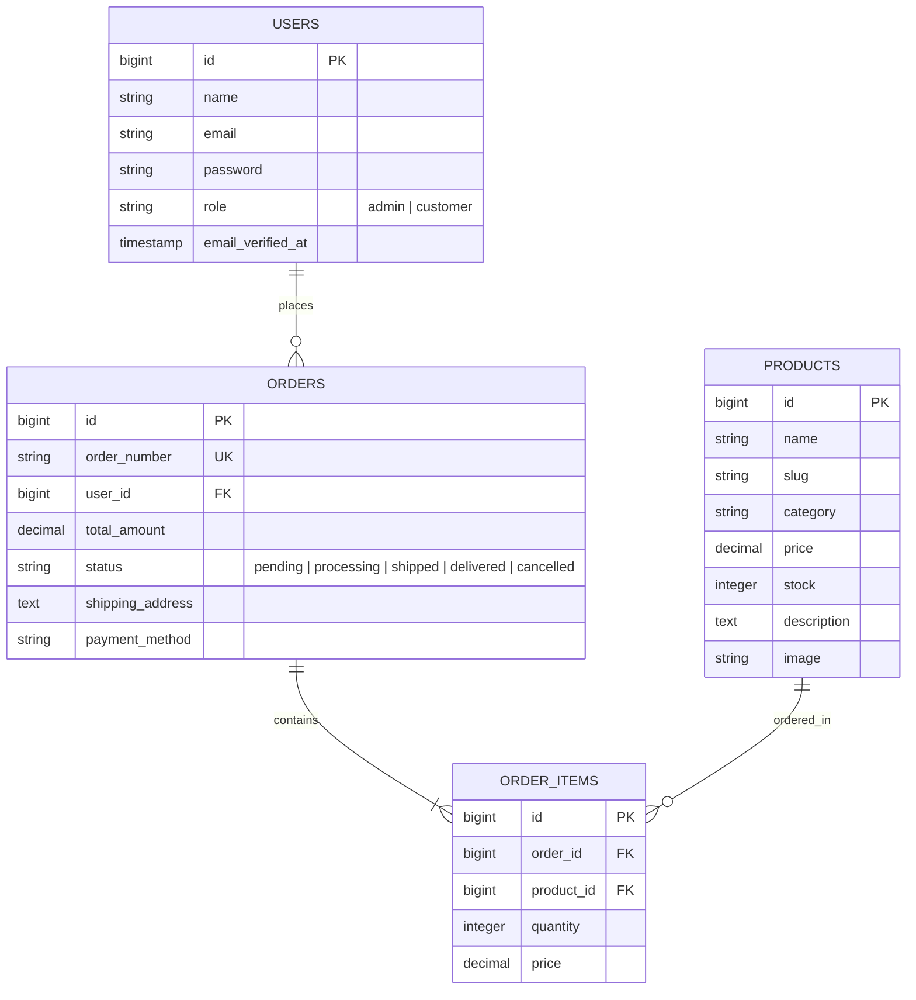

<p align="center">
  <a href="https://laravel.com" target="_blank">
    
  </a>
</p>

<h1 align="center">🌾 Organic Punjab — E-Commerce Platform</h1>

<p align="center">
  <strong>A premium, full-featured Laravel 13 e-commerce store dedicated to authentic, farm-fresh organic food products.</strong>
</p>

<p align="center">
  <a href="#-tech-stack"></a>
  <a href="#-tech-stack"></a>
  <a href="#-tech-stack"></a>
  <a href="#-tech-stack"></a>
  <a href="#-testing--quality"></a>
  <a href="LICENSE"></a>
</p>

---

## 📋 Table of Contents

- [About the Project](#-about-the-project)
- [Key Features](#-key-features)
- [Tech Stack](#-tech-stack)
- [Database Schema](#-database-schema)
- [Getting Started](#-getting-started)
  - [Prerequisites](#prerequisites)
  - [Installation & Setup](#installation--setup)
- [Troubleshooting & Key Fixes](#-troubleshooting--key-fixes)
- [Testing & Quality](#-testing--quality)
- [Project Directory Structure](#-project-directory-structure)
- [Routes Overview](#-routes-overview)
- [License](#-license)

---

## 🍃 About the Project

**Organic Punjab** brings traditional, organic food products—such as Pure Desi Ghee, Cold-Pressed Mustard Oil, Organic Raw Honey, Jaggery (Shakkar), and Hand-Pounded Spices—directly from local farms to customers' homes. 

Built on **Laravel 13** and **PHP 8.3**, the application delivers a modern responsive storefront, real-time AJAX shopping cart, seamless checkout flow, live order tracking, customer profile management, and a robust administrative control center.

---

## ✨ Key Features

### 🛒 Customer Storefront
- **Dynamic Product Catalog**: Clean grid displaying organic items with category filters, pricing, ratings, and stock status.
- **Interactive Shopping Cart**: AJAX-powered cart slide-over/modal supporting item updates, deletions, subtotal calculations, shipping estimations, and coupon codes.
- **Seamless Checkout**: Address collection, order summary validation, and multiple simulated payment methods.
- **Live Order Tracking**: Public and user-authenticated tracking by Order Number with real-time status updates (`Pending`, `Processing`, `Shipped`, `Delivered`, `Cancelled`).
- **Customer Dashboard**: Personal portal (`/customer/dashboard`) for reviewing past purchases and account details.

### ⚙️ Administrative Control Panel (`/admin/*`)
- **Executive Dashboard**: Real-time sales metrics, revenue analytics, total order counts, and active user insights.
- **Product Management**: Full CRUD operations for creating products, updating prices, modifying inventory, setting categories, and uploading product imagery.
- **User Management**: View registered user accounts with real-time search filtering and administrative moderation tools.
- **Order Status Management**: Change order fulfillment states dynamically with instant status propagation.

---

## 🛠 Tech Stack

| Domain | Technology |
|---|---|
| **Backend Framework** | Laravel 13.x (PHP 8.3+) |
| **Frontend Styling** | Tailwind CSS v4 |
| **Asset Bundling** | Vite 8.x |
| **Database** | SQLite / MySQL (Eloquent ORM) |
| **Testing** | PHPUnit 12 |
| **Code Formatting** | Laravel Pint |

---

## 🗄 Database Schema



---

## 🚀 Getting Started

### Prerequisites

Ensure your development environment meets the following requirements:
- **PHP**: `^8.3`
- **Composer**: `^2.x`
- **Node.js**: `^20.x` or `^22.x` & **npm**
- **SQLite** or **MySQL** database server

### Installation & Setup

1. **Clone the Repository**
   ```bash
   git clone https://github.com/your-username/organic-punjab.git
   cd organic-punjab
   ```

2. **Run Quick Composer Setup**
   ```bash
   composer run setup
   ```

   *Alternatively, follow the step-by-step manual setup below:*

3. **Install PHP & Node Dependencies**
   ```bash
   composer install
   npm install
   ```

4. **Configure Environment File**
   ```bash
   cp .env.example .env
   ```

5. **Generate Application Key** *(Crucial step to prevent HTTP 500 errors)*
   ```bash
   php artisan key:generate
   ```

6. **Run Database Migrations & Seeders**
   ```bash
   php artisan migrate --seed
   ```

7. **Start Development Servers**
   In one terminal, run the Laravel application:
   ```bash
   php artisan serve
   ```
   In a second terminal, start the Vite frontend asset watcher:
   ```bash
   npm run dev
   ```

8. **Access Application**
   - Storefront: [http://localhost:8000](http://localhost:8000)
   - Admin Panel: [http://localhost:8000/admin/dashboard](http://localhost:8000/admin/dashboard)

---

## 🔧 Troubleshooting & Key Fixes

> [!IMPORTANT]
> **HTTP 500 Internal Server Error (Missing APP_KEY)**
> If the web server returns a `500 Server Error` with `MissingAppKeyException`, run:
> ```bash
> php artisan key:generate
> php artisan config:clear
> ```

> [!NOTE]
> **Frontend Assets Not Loading / Vite Exception**
> If assets fail to load or Vite manifest errors occur, run:
> ```bash
> npm run build
> ```

---

## 🧪 Testing & Quality

### Running Automated Feature Tests

The application includes unit & feature tests covering Authentication, Admin Products, User Management, and Order Workflows.

Run the test suite via Artisan:
```bash
php artisan test
```

### Code Style Formatting

Ensure PHP code adheres to project standards using Laravel Pint:
```bash
vendor/bin/pint
```

---

## 📁 Project Directory Structure

```text
organic-punjab/
├── app/
│   ├── Http/
│   │   ├── Controllers/
│   │   │   ├── Admin/          # Dashboard, Product CRUD, User management
│   │   │   ├── Auth/           # Login & Registration controllers
│   │   │   ├── Customer/       # Customer dashboard controller
│   │   │   ├── CartController.php
│   │   │   ├── CheckoutController.php
│   │   │   ├── HomeController.php
│   │   │   └── OrderController.php
│   │   └── Middleware/         # Auth & Admin access control
│   └── Models/                 # User, Product, Order, OrderItem
├── database/
│   ├── factories/             # Database factories
│   ├── migrations/            # Table schemas for users, products, orders
│   └── seeders/               # Seed data for demo storefront
├── resources/
│   ├── css/                   # Tailwind CSS v4 custom styles
│   ├── js/                    # Client-side interactive scripts
│   └── views/                 # Blade templates (storefront, cart, admin)
├── routes/
│   ├── api.php                # API endpoints
│   ├── console.php            # Console commands
│   └── web.php                # Application web routes
└── tests/
    └── Feature/               # Automated HTTP & Integration test suites
```

---

## 🌐 Routes Overview

| Method | URI | Controller Action | Description |
|---|---|---|---|
| `GET` | `/` | `HomeController@index` | Storefront Homepage |
| `GET` | `/cart` | `CartController@index` | View Shopping Cart |
| `POST` | `/cart/add` | `CartController@add` | Add Item to Cart |
| `GET` | `/checkout` | `CheckoutController@index` | Checkout Form Page |
| `POST` | `/checkout` | `CheckoutController@store` | Place Order |
| `GET` | `/orders/{order_number}` | `OrderController@show` | View Order Receipt |
| `GET` | `/track-order` | `OrderController@track` | Track Order Status |
| `GET` | `/customer/dashboard` | `Customer\DashboardController@index` | Customer Portal |
| `GET` | `/admin/dashboard` | `Admin\DashboardController@index` | Admin Analytics Dashboard |
| `RESOURCE` | `/admin/products` | `Admin\ProductController` | Admin Product CRUD |
| `GET` | `/admin/users` | `Admin\UserController@index` | Admin User Management |

---

## 📜 License

This project is open-sourced software licensed under the [MIT License](LICENSE).
